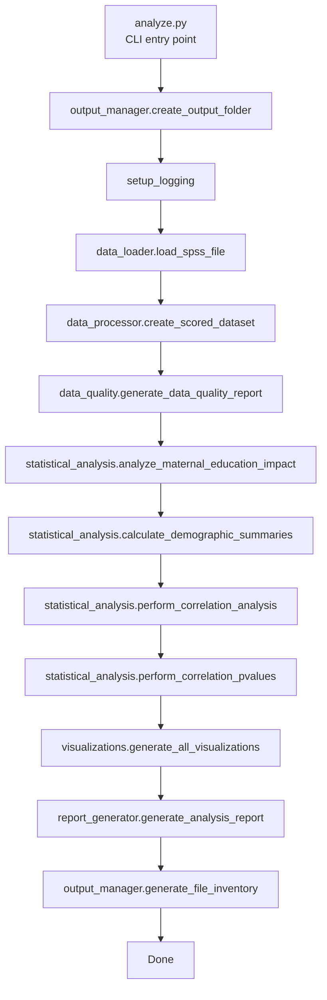
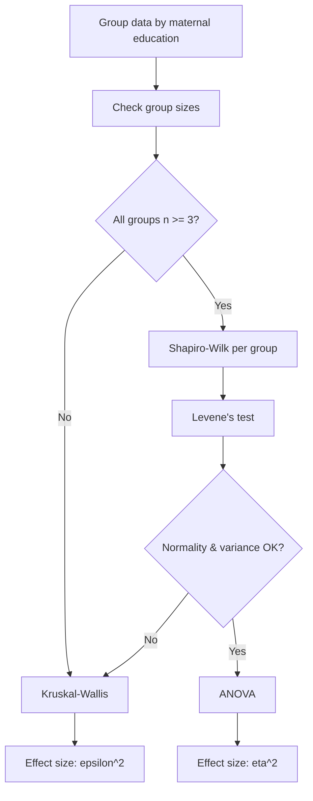
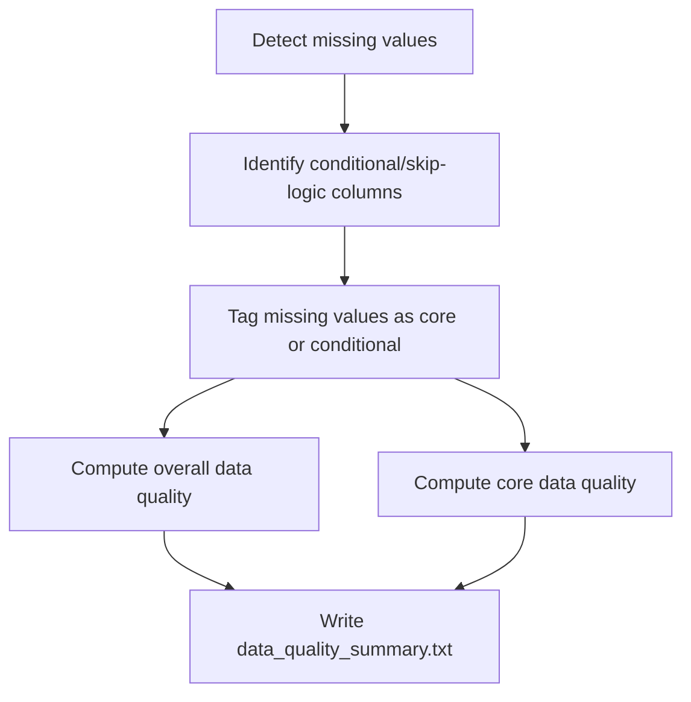

# Developer Pipeline Flow

This document explains how the analysis pipeline works end-to-end and how the code modules interact. It is intended for developers who will maintain or extend the system.

## 1. Pipeline Overview (High Level)

## 2. Stage-by-Stage Breakdown

1) **Setup**
- Create timestamped output folder
- Configure logging (console + `analysis.log`)

2) **Data Loading**
- `data_loader.load_spss_file` reads the SPSS file
- Filters empty rows based on missing maternal education
- Returns DataFrame + metadata (row counts, labels)

3) **Data Processing**
- `data_processor.create_scored_dataset` adds:
  - `total_family_members`
  - `per_capita_income`
  - `knowledge_score`
  - `practice_score`
  - `total_score`

4) **Data Quality**
- `data_quality.generate_data_quality_report`:
  - Detects missing and invalid values
  - Classifies conditional/skip-logic columns vs core columns
  - Writes `data_quality_summary.txt` and CSVs

5) **Statistical Analysis**
- Maternal education impact:
  - Assumption checks (Shapiro-Wilk, Levene, group size)
  - ANOVA or Kruskal-Wallis based on assumptions
  - Effect size (eta^2 or epsilon^2)
- Demographic summaries (freq + descriptive stats)
- Correlations + correlation p-values

6) **Visualizations**
- Bar chart by maternal education
- Score distributions
- Box plots by education group
- Scatter matrix

7) **Report + Inventory**
- `analysis_report.md` and `analysis_report.txt`
- `FILE_INVENTORY.md` lists all outputs

## 3. Key Module Responsibilities

| Module | Purpose | Key Outputs |
| --- | --- | --- |
| `data_loader.py` | Read SPSS, filter empty rows, metadata | DataFrame + metadata |
| `data_processor.py` | Compute scores and derived fields | `scored_dataset.csv` |
| `data_quality.py` | Missing/invalid checks, conditional classification | `data_quality_summary.txt` + CSVs |
| `statistical_analysis.py` | Tests, summaries, correlations | summary tables + matrices |
| `visualizations.py` | Charts at 300 DPI | PNG files |
| `report_generator.py` | Assemble narrative report | `analysis_report.md/txt` |
| `output_manager.py` | Output folder + inventory | `FILE_INVENTORY.md` |

## 4. Statistical Test Selection Flow

## 5. Data Quality Classification Flow

## 6. Output Map (What Gets Written)

- `scored_dataset.csv`
- `maternal_education_summary.csv`
- `demographic_*.csv`
- `correlation_matrix.csv`
- `correlation_pvalues.csv`
- `data_quality_summary.txt`
- `data_quality_missing_values.csv`
- `scores_by_maternal_education.png`
- `score_distributions.png`
- `score_boxplots.png`
- `scatter_matrix.png`
- `analysis_report.md` and `analysis_report.txt`
- `analysis.log`
- `FILE_INVENTORY.md`

## 7. Developer Extension Points

- **Add a new outcome score**: implement in `data_processor.py` and include in `report_generator.py`.
- **Add new statistical tests**: extend `statistical_analysis.py` and surface results in reports.
- **Add new plots**: implement in `visualizations.py` and reference in the report generator.
- **Add new data quality rules**: extend `_get_default_validation_rules` in `data_quality.py`.

## 8. Developer Helper Scripts

Optional utilities are stored in `src/dev_tools/`. See `src/dev_tools/README.md` for details.
