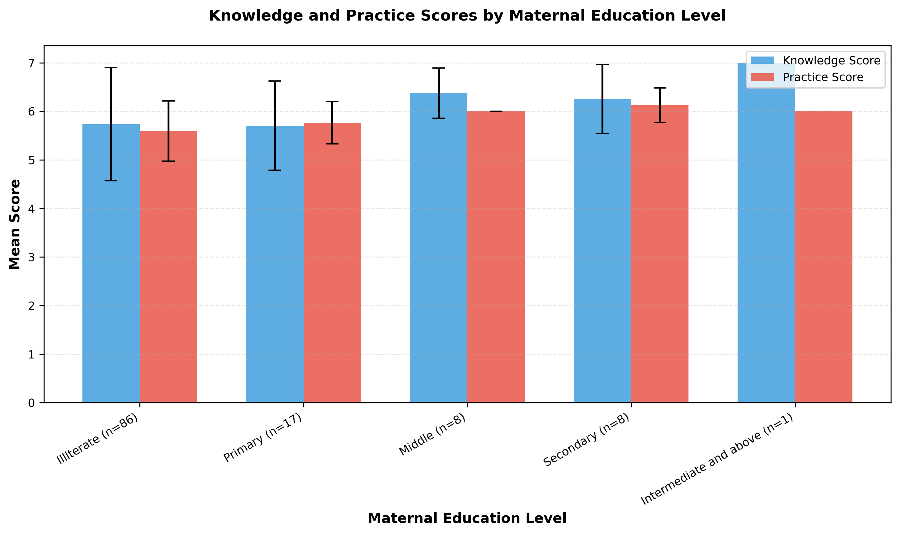
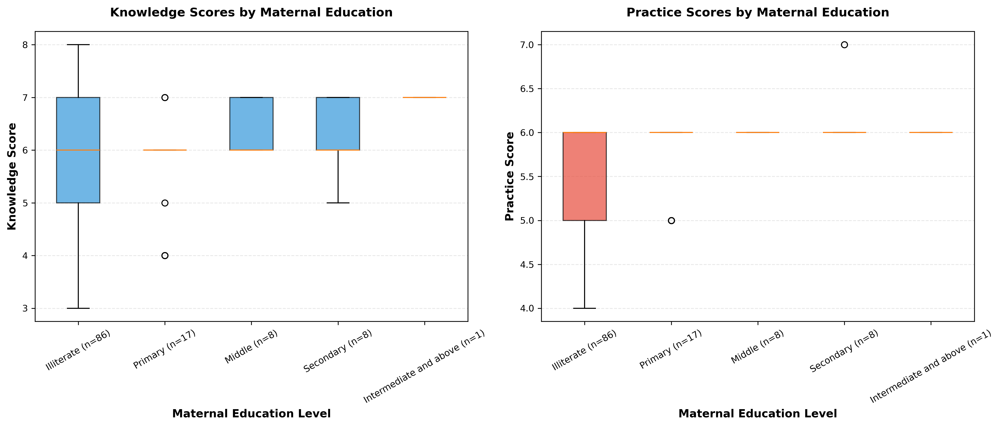
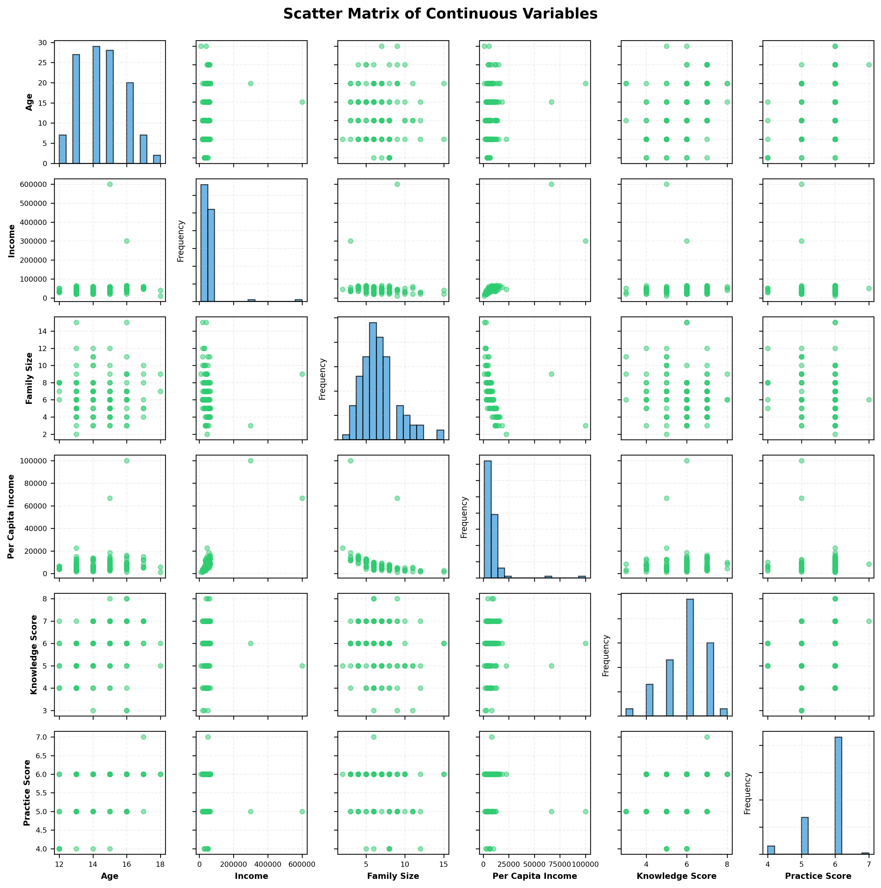

# Menstrual Hygiene Awareness in Adolescent Girls: Exploring the Influence of Maternal Education on Knowledge and Practices in a Sub-Urban Area of Pakistan

**Supervisor:** Dr Naureen Omar

**Investigators:** Dr Ayesha Javed, Dr Fatima Sohail

## Abstract

Menstrual hygiene management is an adolescent health concern in low-resource settings, where stigma, limited menstrual health literacy, and inadequate access to safe hygiene materials can affect health, dignity, and school participation [1-3]. This study assessed menstrual hygiene knowledge and practices among adolescent girls in a sub-urban area of Lahore, Pakistan, and examined differences across maternal education categories. Of 160 records loaded from the finalized school-survey SPSS file, 40 fully blank trailing records were removed, leaving 120 participants. Knowledge scores ranged from 0 to 9 and practice scores from 0 to 7 under archived questionnaire rules with one adjudicated scoring correction; missing questionnaire responses were scored zero. Descriptive statistics, data-quality checks, group comparisons, and correlations were performed. Kruskal-Wallis tests were used because scores were bounded and discrete and maternal education groups were imbalanced. Mean age was 14.47 years (range 12-18). Mean knowledge was 6.65/9 (SD 1.22), and mean practice was 5.68/7 (SD 0.58). Practice differed nominally across maternal education groups only in the unadjusted analysis (H = 10.1562, unadjusted p = 0.0379, epsilon-squared = 0.0853; Holm-adjusted p = 0.0758); the knowledge comparison was not significant (H = 8.0427, p = 0.0900, epsilon-squared = 0.0676). The complete-case practice analysis was also non-significant (H = 8.6488, p = 0.0705). Age correlated with knowledge (r = 0.314, p = 0.0005), and knowledge correlated with practice (r = 0.317, p = 0.0004). The post-processing issue-free cell rate was 88.70% overall and 99.70% after excluding conditional and skip-logic variables. These cross-sectional, unadjusted findings are exploratory; age confounding, group imbalance, scoring limitations, and unverifiable ethics documentation preclude causal or firm independent-effect claims.

**Keywords:** menstrual hygiene; adolescent girls; maternal education; Pakistan; school health; cross-sectional study

## 1. Introduction

Adolescence is a formative period for health attitudes and behaviors. Menstrual health is integral to adolescent well-being because girls must manage menarche, menstrual cycles, hygiene, and stigma, often without adequate information or material support. World Health Organization and UNESCO guidance frames menstrual health as a health, education, rights, and gender-equity issue requiring suitable materials, knowledge, supportive norms, and safe sanitation [1-3].

In low- and middle-income settings, menstrual hygiene management may be constrained by silence, cultural taboos, limited privacy, and inadequate absorbents or disposal facilities. Girls may reach menarche unprepared and depend on informal or incomplete information, potentially impairing hygiene, causing discomfort and embarrassment, and limiting school and social participation. Studies from Ghana, Ethiopia, Nepal, India, and related settings associate menstrual knowledge and practice with parental education, information access, and socioeconomic conditions [4-10].

These relationships are particularly relevant in sub-urban Pakistan, where educational attainment, household resources, and social norms vary. Maternal education may influence daughters through communication, supervision, modeled routines, and access to menstrual products. However, it may produce limited differences in formal knowledge when peers, media, or schools also provide information. This study assessed menstrual hygiene knowledge and practices among adolescent girls in a sub-urban area of Lahore and compared outcomes across maternal education categories.

## 2. Rationale and Objectives

The study examined whether maternal education was associated more strongly with menstrual knowledge or behavior, recognizing that awareness may not improve practice when household circumstances, product access, or sanitation impose constraints. The primary objectives were to assess knowledge and practice scores and compare them by maternal education. Secondary objectives were to describe demographic and household economic characteristics and explore correlations among age, income, family size, and menstrual hygiene scores.

## 3. Methods

### 3.1 Study design, setting, and source protocol

This structured secondary analysis used the finalized survey dataset in the project workspace. The source protocol in `doc.md` planned a nine-month school-based questionnaire study from March to December 2024 at Reach School on Sau Asal Road, Lahore. It specified school-based recruitment, a structured questionnaire administered by the primary investigators, and interviews lasting approximately 15-20 minutes.

### 3.2 Participant selection and analytic sample

The protocol included adolescent girls with parental consent and excluded students without parental consent or willingness to participate. It described simple random sampling by lottery from a list of eligible female students. The analytic workflow loaded 160 SPSS records and removed 40 fully blank trailing records, leaving 120 valid participant records.

### 3.3 Study variables

The outcomes were bounded discrete menstrual hygiene knowledge (0-9) and practice (0-7) scores. Maternal education was coded from SPSS metadata as 1 = Illiterate, 2 = Primary, 3 = Middle, 4 = Secondary, and 5 = Intermediate and above. Other descriptive and exploratory variables were age, paternal education, maternal and paternal occupation, monthly household income, family size, and per-capita income.

### 3.4 Scoring rules and derived variables

Knowledge was calculated from Section III questionnaire items using the archived protocol with one adjudicated correction. The archived key awarded the menstruation-process point to code 2, although SPSS metadata labeled code 1 as physiological/natural and code 2 as pathological/disease. The corrected primary analysis awarded the point to code 1 because menstruation is physiological; the original coding was retained for sensitivity analysis and audit. Practice was calculated from Section IV under the archived scheme. Missing or out-of-label questionnaire responses received zero. Four archived items awarded one point to every listed response: the absorbent and change-frequency items in both knowledge and practice. They contributed to totals but did not discriminate among participants. Per-capita income equaled monthly household income divided by total family members; it was set to null, not imputed, when income or family size was missing or family size was zero.

### 3.5 Data quality procedures

The pipeline quantified missingness, out-of-label categorical values, and affected rows and columns. Responses were checked against SPSS value domains. Overall and core data quality were separated because several questionnaire fields were conditional follow-ups, preventing expected skip-pattern missingness from being classified as poor capture. Reported total family size was also compared with the sum of male and female family members.

### 3.6 Statistical analysis

All tests were two-sided with a 0.05 significance threshold. Categorical variables were summarized as counts and percentages; continuous variables were summarized using means, medians, standard deviations, minima, maxima, and quartiles. Within-group normality was assessed by Shapiro-Wilk tests when group size permitted, variance homogeneity by Levene's test when feasible, and small groups were identified. Because knowledge and practice were bounded, discrete, and distributed across markedly imbalanced education groups, primary comparisons used Kruskal-Wallis tests with epsilon-squared effect sizes. Primary p-values were reported unadjusted, with Holm correction across the two outcomes to assess familywise robustness.

Pearson complete-case correlations assessed linear relationships among age, income, family size, per-capita income, knowledge, practice, and total score. These secondary analyses were exploratory and unadjusted for multiplicity. Spearman correlations examined sensitivity to strongly right-skewed, outlier-prone income. Further sensitivity analyses excluded the highest maternal education category, treated maternal education as ordinal, tested age differences across education groups, restricted practice analysis to complete cases, and reproduced the archived scoring key.

### 3.7 Ethical considerations

The protocol planned parental consent, confidentiality, anonymity, school permission, and institutional review. Completion cannot be established from the archived bundle: no reportable ethics approval identifier is present, and the appended consent text concerns bullying rather than menstrual hygiene. The study-specific consent form and ethics record must be confirmed before submission. No unverified approval or consent is claimed.

## 4. Results

### 4.1 Participant flow

The SPSS file contained 160 raw records. Removal of 40 fully blank trailing records left 120 participants (Table 1).

| Stage | n |
| --- | ---: |
| Raw records loaded | 160 |
| Removed (fully blank trailing records) | 40 |
| Final records analyzed | 120 |

### 4.2 Demographic and household characteristics

Mean age was 14.47 years (SD 1.40; range 12-18). Monthly household income was widely dispersed (mean 48,833.33; maximum 600,000), indicating substantial right-skewness. Mean family size was 6.66 and mean per-capita income was 8,648.83. Maternal education was predominantly illiterate (71.7%) or primary (14.2%); only one participant was in the Intermediate-and-above category (Table 2).

| Variable | Category/Statistic | Value |
| --- | --- | --- |
| Age (years) | Mean +/- SD | 14.47 +/- 1.40 |
| Age (years) | Median (IQR) | 14.0 (13.0-15.0) |
| Age (years) | Range | 12-18 |
| Monthly income | Mean +/- SD | 48,833.33 +/- 57,440.99 |
| Monthly income | Median (IQR) | 45,000 (30,000-50,000) |
| Family size | Mean +/- SD | 6.66 +/- 2.38 |
| Family size | Median (IQR) | 6 (5-8) |
| Per-capita income | Mean +/- SD | 8,648.83 +/- 10,763.62 |
| Per-capita income | Median (IQR) | 6,428.57 (4,285.71-10,000) |
| Maternal education | Illiterate | 86 (71.7%) |
| Maternal education | Primary | 17 (14.2%) |
| Maternal education | Middle | 8 (6.7%) |
| Maternal education | Secondary | 8 (6.7%) |
| Maternal education | Intermediate and above | 1 (0.8%) |
| Maternal occupation | Non-working | 103 (85.8%) |
| Maternal occupation | Working | 14 (11.7%) |
| Maternal occupation | Other/unlabeled code | 3 (2.5%) |
| Paternal education | Primary | 35 (29.2%) |
| Paternal education | Middle | 28 (23.3%) |
| Paternal education | Secondary | 24 (20.0%) |
| Paternal education | Illiterate | 24 (20.0%) |
| Paternal education | Intermediate and above | 9 (7.5%) |

### 4.3 Knowledge and practice score distributions

Knowledge scores ranged from 3 to 9 (mean 6.65; median 7.00), and practice scores from 4 to 7 (mean 5.68; median 6.00). Practice was more tightly clustered. The modal knowledge score was 7 (37.5%), and the modal practice score was 6 (71.7%) (Table 3; Figure 1).

| Score domain | Summary |
| --- | --- |
| Knowledge score (0-9) | Mean 6.65, Median 7.00, SD 1.22, Min 3, Max 9 |
| Practice score (0-7) | Mean 5.68, Median 6.00, SD 0.58, Min 4, Max 7 |

### 4.4 Scores by maternal education

Mean scores increased modestly across some education categories, but the severe group imbalance, including one participant in the highest category, limited interpretation. Mean knowledge ranged from 6.53 in the illiterate and primary groups to 8.00 in the Intermediate-and-above group; mean practice ranged from 5.59 in the illiterate group to 6.12 in the secondary group (Table 4; Figures 2 and 3).

| Maternal education level | n | Knowledge mean +/- SD | Knowledge median (IQR) | Practice mean +/- SD | Practice median (IQR) |
| --- | ---: | ---: | ---: | ---: | ---: |
| Illiterate | 86 | 6.53 +/- 1.27 | 7.0 (6.0-7.0) | 5.59 +/- 0.62 | 6.0 (5.0-6.0) |
| Primary | 17 | 6.53 +/- 1.23 | 7.0 (7.0-7.0) | 5.76 +/- 0.44 | 6.0 (6.0-6.0) |
| Middle | 8 | 7.38 +/- 0.52 | 7.0 (7.0-8.0) | 6.00 +/- 0.00 | 6.0 (6.0-6.0) |
| Secondary | 8 | 7.25 +/- 0.71 | 7.0 (7.0-8.0) | 6.12 +/- 0.35 | 6.0 (6.0-6.0) |
| Intermediate and above | 1 | 8.00 | 8.0 (8.0-8.0) | 6.00 | 6.0 (6.0-6.0) |

### 4.5 Inferential analysis for maternal education

Assumption checks did not support parametric comparisons. The omnibus knowledge comparison was not significant (H = 8.0427, unadjusted p = 0.0900, epsilon-squared = 0.0676). Practice was nominally significant only before multiplicity correction (H = 10.1562, unadjusted p = 0.0379, epsilon-squared = 0.0853; Holm-adjusted p = 0.0758) and is therefore exploratory, not familywise-error-robust evidence. A significant result for one outcome and a non-significant result for another does not establish that their associations differ (Table 5).

| Outcome | Test | Statistic | p-value | Effect size (epsilon-squared) | Interpretation |
| --- | --- | ---: | ---: | ---: | --- |
| Knowledge score | Kruskal-Wallis | H = 8.0427 | 0.0900 | 0.0676 | Omnibus comparison not statistically significant |
| Practice score | Kruskal-Wallis | H = 10.1562 | 0.0379 | 0.0853 | Nominal p < 0.05; Holm-adjusted p = 0.0758 |

### 4.6 Correlation analysis

Pearson complete-case correlations were positive for age with knowledge (r = 0.314, p = 0.0005), age with practice (r = 0.267, p = 0.0032), and knowledge with practice (r = 0.317, p = 0.0004). Family size correlated negatively with knowledge (r = -0.201, p = 0.0279). Household and per-capita income were not significantly correlated with either score. These secondary analyses were exploratory because multiple correlations were tested without adjustment. Total-score correlations were not interpreted because total score is mathematically derived from knowledge and practice (Table 6; Figure 4).

| Variable pair | r | p-value | Interpretation |
| --- | ---: | ---: | --- |
| Age vs Knowledge score | 0.314 | 0.0005 | Moderate positive association |
| Knowledge score vs Practice score | 0.317 | 0.0004 | Weak-to-moderate positive association |
| Age vs Practice score | 0.267 | 0.0032 | Weak positive association |
| Family size vs Knowledge score | -0.201 | 0.0279 | Weak negative association |
| Family size vs Practice score | -0.165 | 0.0725 | Not significant |
| Income vs Knowledge score | -0.042 | 0.6501 | Not significant |
| Income vs Practice score | -0.122 | 0.1834 | Not significant |
| Per-capita income vs Knowledge score | 0.040 | 0.6637 | Not significant |
| Per-capita income vs Practice score | -0.077 | 0.4040 | Not significant |

### 4.7 Data quality and sensitivity analyses

The transformed 41-column dataset contained 550 missing cells and six out-of-label categorical responses among 4,920 cells, yielding 88.70% overall issue-free cell rate. This denominator included optional free-text and five derived fields. Invalid values were three maternal-occupation codes of 3, two menstruation-process codes of 5, and one handwashing code of 3. Core issue-free cell rate was 99.70% after conditional and skip-logic variables were excluded. No inconsistency was found between total family size and summed male and female family members.

Excluding the sole participant in maternal education category 5 left knowledge non-significant (H = 6.3719, p = 0.0949, epsilon-squared = 0.0540), while unadjusted practice remained below 0.05 (H = 9.7515, p = 0.0208, epsilon-squared = 0.0826). Restriction to 115 participants with complete responses on all seven practice items produced H = 8.6488, p = 0.0705, and epsilon-squared = 0.0759; thus, practice was nominally significant only in the primary unadjusted analysis and was sensitive to the archived missing-as-zero rule. Ordinal education correlated positively with knowledge (rho = 0.2023, p = 0.0267) and practice (rho = 0.2684, p = 0.0030), but these exploratory trends were not multiplicity-adjusted. Age differed among education groups (H = 10.6913, p = 0.0303), leaving plausible confounding.

Spearman analyses retained positive associations between age and knowledge (rho = 0.3710, p < 0.001) and between knowledge and practice (rho = 0.3650, p < 0.001). Unlike Pearson analysis, Spearman analysis showed a weak positive income-knowledge association (rho = 0.2160, p = 0.0178); income-practice remained non-significant (rho = 0.0544, p = 0.5550). Using the archived pathological-response key yielded a mean knowledge score of 5.82 and a non-significant omnibus comparison (H = 5.8669, p = 0.2093, epsilon-squared = 0.0493) (Table 7).

| Sensitivity analysis | Knowledge result | Practice result | Interpretation |
| --- | --- | --- | --- |
| Excluding maternal education level 5 (n = 1) | H = 6.3719, p = 0.0949, epsilon-squared = 0.0540 | H = 9.7515, p = 0.0208, epsilon-squared = 0.0826 | Unadjusted practice p remains below 0.05; knowledge remains non-significant |
| Complete practice responses only | Unchanged | H = 8.6488, p = 0.0705, epsilon-squared = 0.0759; n = 115 | Practice result is sensitive to missing-response handling |
| Maternal education treated as ordinal | rho = 0.2023, p = 0.0267 | rho = 0.2684, p = 0.0030 | Exploratory monotonic trends; unadjusted for multiplicity |
| Age across maternal-education groups | H = 10.6913, p = 0.0303 | - | Age is a plausible confounder |
| Archived pathological-response scoring key | Mean 5.82; H = 5.8669, p = 0.2093, epsilon-squared = 0.0493 | Unchanged | Main significance classification is unchanged |
| Spearman rank correlation (age-knowledge) | rho = 0.3710, p < 0.001 | - | Positive association remains |
| Spearman rank correlation (knowledge-practice) | rho = 0.3650, p < 0.001 | - | Positive association remains |
| Spearman rank correlation (income-knowledge / income-practice) | rho = 0.2160, p = 0.0178 | rho = 0.0544, p = 0.5550 | Weak income-knowledge association appears only in the rank-based analysis |

## 5. Figures

### Figure 1. Distribution of knowledge and practice scores

### Figure 2. Mean knowledge and practice scores by maternal education level

### Figure 3. Boxplots of knowledge and practice scores by maternal education level

### Figure 4. Scatter matrix of continuous variables

## 6. Discussion

Practice scores differed across maternal education groups only at the unadjusted 0.05 level; the knowledge comparison was not significant. The practice result did not survive Holm correction and was non-significant in the complete-case sensitivity analysis (p = 0.0705). No formal test compared the strengths of the knowledge and practice associations. The finding is therefore exploratory. Household routines, product access, supervision, and age may contribute, but this unadjusted analysis cannot distinguish their effects.

The positive age-knowledge correlation is compatible with greater menstrual experience and accumulated information among older adolescents. Knowledge also correlated positively with practice, but not strongly enough to imply automatic behavioral translation. Structural barriers, stigma, and limited access may modify this relationship.

### 6.1 Comparative review methods

A structured comparative review searched PubMed and OpenAlex for primary studies of adolescent menstrual-hygiene knowledge, practice, maternal or parental education, and enabling resources. Pakistan was prioritized, followed by other South Asian settings and one Ethiopian study with directly comparable adjusted maternal-education models. DOI identity was checked through Crossref and the DOI Handle service. The final set comprised 12 primary studies: five from Pakistan, six from other South Asian settings, and one from Ethiopia. Eleven were reviewed in full text; one Nepal study was limited to its publisher abstract because its PDF was unavailable. Heterogeneous instruments, thresholds, populations, and definitions of good knowledge or practice precluded pooling or direct ranking of nominal percentages.

### 6.2 Comparison with published studies

| Study | Main comparable finding | Relationship to the present study |
| --- | --- | --- |
| Wasan et al., rural Sindh [11] | Only 25% of 25,305 participants used materials classified as appropriate; no participant education versus higher secondary/university predicted inappropriate material use (OR 3.90, 95% CI 3.36-4.52). | Supports an education-practice pathway and a strong role for material access, but measured the participant's education rather than maternal education. |
| Aziz et al., Khairpur, Sindh [12] | Satisfactory knowledge was 69.8% in the urban school and 38.4% in the rural school; good practice was 71.1% and 11.9%, respectively. Mothers were the main information source in both groups. | Demonstrates major contextual variation within Pakistan but did not test maternal education against outcomes. |
| Shah et al., Ghizer, Pakistan [13] | Among 300 girls, 51.7% lacked awareness at menarche, 47.7% used reusable cloth/towels, and 30.7% used disposable pads; 65.3% of mothers had no education. | Supports a maternal information pathway, but maternal education was discussed rather than statistically tested. |
| Michael et al., Quetta, Pakistan [14] | Mothers were the main information source for 67%; 77.7% had received no school menstrual-education session; 68.7% used commercial pads. | Reinforces reliance on maternal information while showing that knowledge and product use can diverge. |
| Afzaal et al., rural Lahore [15] | Knowledge and practice were positively correlated (r = 0.649, p < 0.001). | The closest geographic comparator agrees with the present positive knowledge-practice correlation, but did not report a maternal-education association. |
| Dasgupta and Sarkar, rural India [16] | Although 48.75% knew sanitary pads were appropriate, only 11.25% used them. | Shows that knowledge does not ensure practice. |
| Kansal et al., rural India [17] | Girls with literate mothers used pads more often than girls with illiterate mothers (62% vs 13%); the association was significant. | Directly agrees with the direction of the present maternal-education/practice finding, although hygiene definitions differed. |
| Yadav et al., Nepal [18] | Most respondents had fair or good knowledge, but only 40% of girls met the study's good-practice definition. | Supports separate assessment of knowledge and practice. |
| Bhusal, Nepal [7] | Literate mothers were associated with lower adjusted odds of good practice (AOR 0.52, 95% CI 0.30-0.88), while literate fathers had higher odds. | Contradicts the expected direction and shows that maternal education is not a universal stand-alone proxy for a supportive menstrual environment. |
| Haque et al., Bangladesh [19] | After an uncontrolled six-month school intervention, high knowledge increased from 51.0% to 82.4% and good practice from 28.8% to 88.9%. | Supports intervention feasibility, but the design cannot establish that education alone caused or sustained the changes. |
| Alam et al., Bangladesh [20] | Accessible girls' toilets were associated with less menstrual-related absence (adjusted prevalence difference -5.4 percentage points, 95% CI -10 to -1.6); restrictions were associated with more absence. | Shows that facilities and social rules can shape behavior independently of knowledge or maternal schooling. |
| Upashe et al., Ethiopia [21] | Maternal secondary-or-higher education predicted good knowledge (AOR 1.51, 95% CI 1.02-2.22) and good practice (AOR 2.03, 95% CI 1.38-2.97). | Agrees with the present practice association but differs by also finding a knowledge association. |

The direction of the nominal practice finding agrees with Kansal et al. and Upashe et al., whereas Bhusal reported an inverse adjusted association [7,17,21]. The non-significant knowledge comparison also differs from Upashe et al. [21]. Direct numerical comparisons are inappropriate because outcome definitions, age ranges, education coding, adjustment, and contexts differed. This study used continuous bounded scores and unadjusted comparisons; several comparators used study-specific binary thresholds and multivariable logistic regression.

Pakistani studies identify mothers as important information sources [12-14] but generally do not estimate whether maternal education independently predicts outcomes. The present local comparison does not assume that frequent maternal communication guarantees accurate information. Its positive knowledge-practice correlation is consistent with the rural Lahore study [15], while Nepalese and Indian evidence shows that adequate knowledge may coexist with weaker practice [16,18]. Product cost, household resources, privacy, sanitation, school facilities, and restrictions can shape behavior independently of knowledge or maternal schooling [11,20]. Maternal education could therefore act through communication, purchasing power, supervision, and household norms rather than education alone.

Strengths include a reproducible pipeline with timestamped outputs, explicit data-quality and assumption checks, effect-size reporting, a family-size consistency check, and targeted sensitivity analyses. Conclusions were unchanged after excluding the single participant in the highest education stratum and under rank-based correlation methods.

Limitations are substantial. The cross-sectional design permits association, not causation. Analyses were unadjusted and bivariate; age differed across maternal education groups, and school context, product access, and family factors were uncontrolled. The nominal practice result did not survive Holm correction and was non-significant in the complete-case analysis. Education groups were severely imbalanced, particularly the highest category, limiting precision; the omnibus test did not identify differing groups. Scoring missing or invalid responses as zero may have lowered scores when non-response did not indicate poor knowledge or practice. Four items were nondiscriminating because every listed response received one point, limiting construct validity and inflating the apparent proportion of the maximum. One knowledge item required post hoc adjudication because the archived key contradicted the biological meaning of its labels, and six responses fell outside SPSS value-label domains. Secondary correlations and ordinal trends were exploratory and unadjusted for multiplicity. The single-school sample may not generalize to other adolescents in Lahore or Pakistan.

Interventions in similar settings should address behavior, caregiver engagement, product access, privacy, and safe disposal rather than factual information alone. Larger, balanced samples, adjusted multivariable models, and prospective or mixed-methods designs are needed to clarify how maternal education relates to menstrual hygiene behavior.

## 7. Conclusion

In this sub-urban Lahore sample, practice scores differed across maternal education groups only nominally in the unadjusted analysis; the omnibus knowledge comparison did not. The practice result was not robust to Holm correction (p = 0.0758) or complete-case analysis (p = 0.0705), and age may confound group differences. Age, knowledge, and practice were positively correlated in exploratory analyses. These cross-sectional findings are hypothesis-generating, not causal. Firm conclusions about an independent maternal education effect require larger studies with validated scoring, balanced education groups, documented ethics procedures, and adjusted models.

## 8. Declarations

### Ethics statement

The source protocol planned parental consent, confidentiality, anonymity, school permission, and institutional review. The archived materials contain no reportable ethics approval identifier or valid menstrual-hygiene-specific consent form; the appended consent text concerns bullying. Ethics approval and consent cannot be confirmed from the available record and must be resolved before submission.

### Funding

No external funding information was provided in the analysis bundle.

### Competing interests

No competing interests were declared in the available source materials.

### Data and materials availability

The manuscript was prepared from corrected analysis outputs in `output/analysis_20260712_224950/`. Public repository information was absent from the archived materials and should be added if required by the target journal.

### Author contributions

Supervisor and investigator roles are reported on the title page. Statistical processing and manuscript assembly used the documented local analysis workflow.

## 9. References

1. World Health Organization. *Strengthening the health sector response to adolescent health and development.* Geneva: WHO; 2010. Available from: https://apps.who.int/iris/bitstream/handle/10665/340531/WHO-FCH-CAH-10-01-eng.pdf?sequence=1&isAllowed=y (No DOI; accessed 2026-03-19).
2. World Health Organization. *WHO statement on menstrual health and rights.* 22 June 2022. Available from: https://www.who.int/news/item/22-06-2022-who-statement-on-menstrual-health-and-rights (No DOI; accessed 2026-03-19).
3. UNESCO. *Puberty and menstrual hygiene management.* Available from: https://www.unesco.org/en/health-education/puberty (No DOI; accessed 2026-03-19).
4. Kumbeni MT, Otupiri E, Ziba FA. Menstrual hygiene among adolescent girls in junior high schools in rural Northern Ghana. *Pan Afr Med J.* 2020;37:190. https://doi.org/10.11604/pamj.2020.37.190.19015
5. Sahiledengle B, Atlaw D, Kumie A, Tekalegn Y, Woldeyohannes D, Agho KE. Menstrual hygiene practice among adolescent girls in Ethiopia: a systematic review and meta-analysis. *PLoS One.* 2022;17(1):e0262295. https://doi.org/10.1371/journal.pone.0262295
6. Belayneh Z, Mekuriaw B. Knowledge and menstrual hygiene practice among adolescent schoolgirls in southern Ethiopia: a cross-sectional study. *BMC Public Health.* 2019;19(1):1595. https://doi.org/10.1186/s12889-019-7973-9
7. Bhusal CK. Practice of menstrual hygiene and associated factors among adolescent school girls in Dang District, Nepal. *Adv Prev Med.* 2020;2020:1292070. https://doi.org/10.1155/2020/1292070
8. Bhusal CK, Bhattarai S, Kafle R, Shrestha R, Chhetri P, Adhikari K. Level and associated factors of knowledge regarding menstrual hygiene among school-going adolescent girls in Dang District, Nepal. *Adv Prev Med.* 2020;2020:8872119. https://doi.org/10.1155/2020/8872119
9. Sonowal P, Talukdar K, Saikia H. Sociodemographic factors and their association with menstrual hygiene practices among adolescent girls in urban slums of Dibrugarh town, Assam. *J Family Med Prim Care.* 2021;10(12):4446-4451. https://doi.org/10.4103/jfmpc.jfmpc_703_21
10. Srivastava U, Singh KK. Exploring knowledge and perceptions of school adolescents regarding pubertal changes and reproductive health. *Indian J Youth Adolesc Health.* 2017;4(1):26-35. https://doi.org/10.24321/2349.2880.201705

11. Wasan Y, Baxter J-AB, Rizvi A, Shaheen F, Junejo Q, Abro MA, et al. Practices and predictors of menstrual hygiene management material use among adolescent and young women in rural Pakistan: a cross-sectional assessment. *J Glob Health.* 2022;12:04059. https://doi.org/10.7189/jogh.12.04059
12. Aziz A, Memon S, Aziz F, Memon F, Khowaja BMH, Zafar SN. A comparative study of the knowledge and practices related to menstrual hygiene among adolescent girls in urban and rural areas of Sindh, Pakistan: a cross-sectional study. *Womens Health (Lond).* 2024;20:17455057241231420. https://doi.org/10.1177/17455057241231420
13. Shah SF, Punjani NS, Rizvi SN, Sheikh SS, Jan R. Knowledge, attitudes, and practices regarding menstrual hygiene among girls in Ghizer, Gilgit, Pakistan. *Int J Environ Res Public Health.* 2023;20(14):6424. https://doi.org/10.3390/ijerph20146424
14. Michael J, Iqbal Q, Haider S, Khalid A, Haque N, Ishaq R, et al. Knowledge and practice of adolescent females about menstruation and menstruation hygiene visiting a public healthcare institute of Quetta, Pakistan. *BMC Womens Health.* 2020;20(1):4. https://doi.org/10.1186/s12905-019-0874-3
15. Afzaal SS, Baloch S, Tahir S, Javed H, Saeed A, Pal MHA, et al. Awareness and practices of menstrual hygiene among rural adolescent schoolgirls in Lahore, Pakistan: a cross-sectional study. *Cureus.* 2024;16(11):e73899. https://doi.org/10.7759/cureus.73899
16. Dasgupta A, Sarkar M. Menstrual hygiene: how hygienic is the adolescent girl? *Indian J Community Med.* 2008;33(2):77-80. https://doi.org/10.4103/0970-0218.40872
17. Kansal S, Singh S, Kumar A. Menstrual hygiene practices in context of schooling: a community study among rural adolescent girls in Varanasi. *Indian J Community Med.* 2016;41(1):39-44. https://doi.org/10.4103/0970-0218.170964
18. Yadav RN, Joshi S, Poudel R, Pandeya P. Knowledge, attitude, and practice on menstrual hygiene management among school adolescents. *J Nepal Health Res Counc.* 2017;15(3):212-216. https://doi.org/10.3126/jnhrc.v15i3.18842
19. Haque SE, Rahman M, Itsuko K, Mutahara M, Sakisaka K. The effect of a school-based educational intervention on menstrual health: an intervention study among adolescent girls in Bangladesh. *BMJ Open.* 2014;4(7):e004607. https://doi.org/10.1136/bmjopen-2013-004607
20. Alam MU, Luby SP, Halder AK, Islam K, Opel A, Shoab AK, et al. Menstrual hygiene management among Bangladeshi adolescent schoolgirls and risk factors affecting school absence: results from a cross-sectional survey. *BMJ Open.* 2017;7(7):e015508. https://doi.org/10.1136/bmjopen-2016-015508
21. Upashe SP, Tekelab T, Mekonnen J. Assessment of knowledge and practice of menstrual hygiene among high school girls in Western Ethiopia. *BMC Womens Health.* 2015;15:84. https://doi.org/10.1186/s12905-015-0245-7

## 10. Appendix: Statistical notes

Primary inference was non-parametric because outcomes were bounded and discrete, education groups were highly imbalanced, and normality assumptions were not adequately satisfied across groups. Epsilon-squared was 0.0676 for knowledge and 0.0853 for practice. Practice was nominally significant only before multiplicity correction and was not significant in the complete-case sensitivity analysis. Post-hoc pairwise comparisons were not emphasized because sparse upper education strata, particularly the single participant in the highest category, would make them unstable and potentially misleading.
