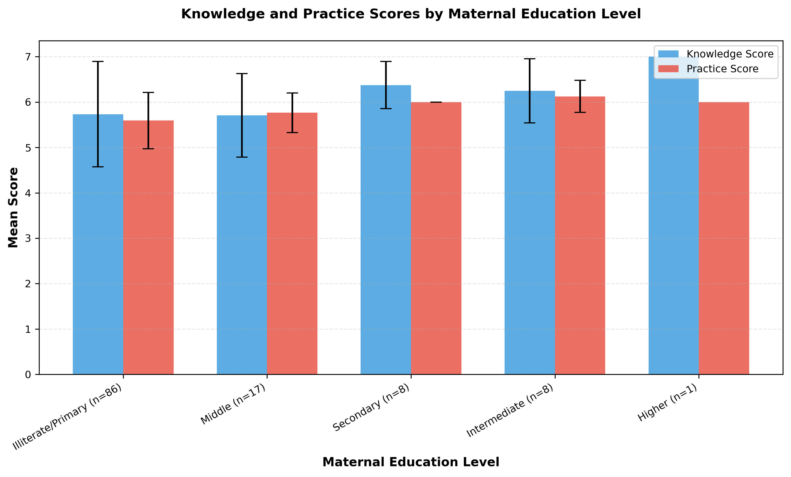
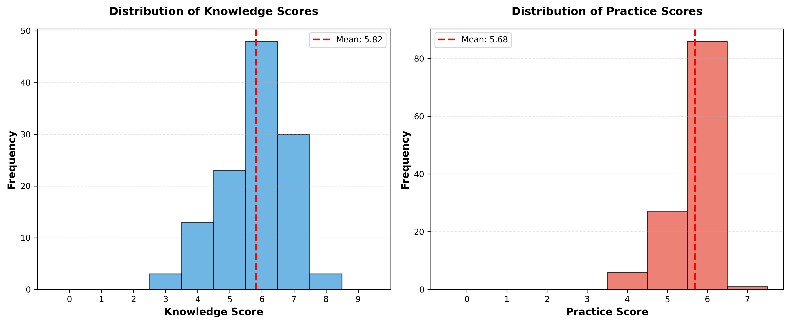
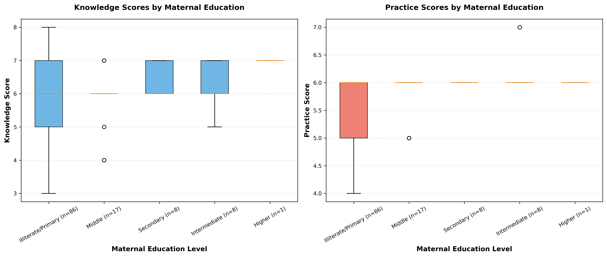

# Menstrual Hygiene Awareness in Adolescent Girls: Exploring the Influence of Maternal Education on Knowledge and Practices in a Sub-Urban Area of Pakistan

**Supervisor:** Dr Naureen Omar  
**Investigators:** Dr Ayesha Javed, Dr Fatima Sohail

---

## Abstract

### Background
Menstrual hygiene management among adolescent girls remains a public health and education challenge in low-resource settings, where social stigma, limited menstrual health literacy, and constrained access to hygiene resources can worsen outcomes. Maternal education is often considered an important determinant of adolescent health behavior, but local data from sub-urban Pakistan are limited.

### Objective
To assess menstrual hygiene knowledge and practices among adolescent girls and determine whether scores differ by maternal education level.

### Methods
This cross-sectional analysis used school-based survey data from a sub-urban area of Lahore, Pakistan. Raw records loaded were 160; 40 empty records (missing maternal education) were excluded per predefined pipeline logic, leaving 120 analyzable participants. Knowledge (0-9) and practice (0-7) scores were computed from questionnaire sections using predefined scoring rules. Missing questionnaire responses were scored as 0. Demographic summaries, group-wise comparisons, and correlation analyses were performed. Normality and variance assumptions were checked (Shapiro-Wilk, Levene), with Kruskal-Wallis selected for group comparisons when assumptions were not met or group sizes were insufficient. Effect size was reported as epsilon-squared for Kruskal-Wallis tests.

### Results
Mean age was 14.47 years (range 12-18). Mean knowledge score was 5.82/9 (SD 1.08), and mean practice score was 5.68/7 (SD 0.58). Maternal education showed a significant association with practice scores (Kruskal-Wallis H=10.1562, p=0.0379, epsilon-squared=0.0535), but not with knowledge scores (H=5.8669, p=0.2093, epsilon-squared=0.0162). Pearson analysis showed positive correlations between age and knowledge (r=0.307, p=0.0007), and between knowledge and practice (r=0.335, p=0.0002). Income was not significantly correlated with knowledge or practice. Overall data quality was 88.82%; core data quality excluding conditional/skip-logic columns was 99.85%.

### Conclusion
In this sample, maternal education was associated with better menstrual hygiene practices but not significantly associated with knowledge scores. Findings support targeting behavior-focused menstrual hygiene interventions, while addressing structural and household-level constraints. Results should be interpreted as associative (not causal) due to the cross-sectional and unadjusted analytic design.

### Keywords
Menstrual hygiene, adolescent girls, maternal education, Pakistan, knowledge score, practice score, Kruskal-Wallis, school health

---

## 1. Introduction

Adolescence is a critical developmental period in which lifelong health behaviors are established. Menstrual health literacy and hygienic practice are particularly important for adolescent girls because they affect physical comfort, infection risk, school participation, and psychosocial well-being. International guidance from WHO and UNESCO frames menstrual health as both a health and rights issue requiring access to accurate information, hygiene products, safe sanitation, and supportive social environments.

In many low- and middle-income settings, menstrual hygiene management is constrained by stigma, silence, and limited resources. Girls may enter menarche with incomplete understanding, rely on informal sources of information, and face practical barriers to product use, washing, and disposal. These challenges are amplified in socioeconomically constrained communities where household resources and parental literacy influence adolescent health behavior.

Within Pakistan, these concerns are highly relevant in sub-urban and peri-urban populations, where heterogeneous education and income profiles intersect with persistent menstrual taboos. Maternal education is frequently hypothesized to shape daughters' knowledge and behavior through communication, supervision, and hygiene norms. However, empirical evidence in local contexts remains sparse.

This study therefore evaluates menstrual hygiene knowledge and practices among adolescent schoolgirls and examines whether these outcomes differ across maternal education categories.

---

## 2. Rationale

This analysis addresses an applied public health question with direct implications for school health programming: does maternal education translate into better menstrual hygiene knowledge and/or better menstrual hygiene practices among adolescent girls in a sub-urban Pakistani setting? The answer helps prioritize intervention design. If knowledge alone is not strongly differentiated but practices are, interventions may need to move beyond awareness messaging toward behavior support, practical enabling resources, and household-level engagement.

---

## 3. Objectives

### Primary Objectives
1. To assess the level of menstrual hygiene knowledge among adolescent girls.
2. To assess menstrual hygiene practices among adolescent girls.
3. To determine whether maternal education level is associated with knowledge and practice scores.

### Secondary Objectives
1. To summarize core sociodemographic characteristics of the sample.
2. To examine correlations among age, household income, family size, per-capita income, and menstrual hygiene scores.
3. To evaluate data quality and missingness patterns relevant to interpretation.

---

## 4. Methods

### 4.1 Study Design and Context
This is a cross-sectional, questionnaire-based analysis using SPSS source data collected from adolescent girls in a school-based setting in sub-urban Lahore, Pakistan.

### 4.2 Participants and Analytic Sample
- Raw records loaded: 160
- Records excluded: 40 (missing maternal education; treated as empty/non-analyzable per pipeline rule)
- Final analyzable sample: 120

### 4.3 Variables

#### Outcomes
- **Knowledge score**: Continuous integer score, range 0-9.
- **Practice score**: Continuous integer score, range 0-7.

#### Primary Predictor
- **Maternal education**: Ordinal categorical variable with five analysis levels:
  - Level 1: Illiterate/Primary
  - Level 2: Middle
  - Level 3: Secondary
  - Level 4: Intermediate
  - Level 5: Higher

#### Additional Covariates/Descriptors
- Age
- Household monthly income
- Family size
- Per-capita income (derived)
- Paternal education and occupation
- Maternal occupation

### 4.4 Scoring Rules and Derived Variables

#### Knowledge Score (0-9)
Derived from Section III questionnaire items using predefined correct-option scoring. Missing responses are assigned 0.

#### Practice Score (0-7)
Derived from Section IV questionnaire items using predefined scoring. Missing responses are assigned 0.

#### Per-Capita Income
Calculated as:

`Per-capita income = Monthly income / Total family members`

If income or family size is missing, or family size is zero, per-capita income is set to null.

### 4.5 Data Quality Framework
Data quality outputs included:
- Overall missingness and invalid value counts
- Column-level missingness report
- Conditional/skip-logic column identification to avoid misclassifying expected missingness as poor data quality
- Family-size consistency checks (reported family members vs male + female members)

### 4.6 Statistical Analysis Plan

All analyses used alpha = 0.05 (two-sided).

#### Descriptive Analysis
- Categorical variables: counts, percentages, proportions
- Continuous variables: mean, median, standard deviation (SD), min, max, quartiles where relevant

#### Group Comparison: Maternal Education vs Scores
- Assumption checks:
  - Shapiro-Wilk normality by group (when n >= 3)
  - Levene's test for variance homogeneity (when feasible)
  - Group-size adequacy screening
- Decision rule:
  - ANOVA if assumptions met
  - Kruskal-Wallis if assumptions violated or insufficient for parametric testing
- Effect size:
  - Epsilon-squared for Kruskal-Wallis

#### Correlation Analysis
- Primary method: Pearson correlation with complete-case p-values.
- Reported key associations: age-knowledge, knowledge-practice, income-score relationships.

### 4.7 Sensitivity Analyses
To address methodological criticism risks, two sensitivity checks were conducted:
1. **Group imbalance sensitivity:** Kruskal-Wallis repeated after excluding maternal education level 5 (n=1).
2. **Skew robustness sensitivity:** Spearman correlations for key variable pairs given strong income skew and outliers.

### 4.8 Ethical Considerations
The source protocol documents parental consent, confidentiality safeguards, and school/institutional permission plans. This manuscript is based on de-identified analytic outputs and does not include personally identifying information.

---

## 5. Results

### 5.1 Participant Flow and Analysis Base

| Stage | n |
| --- | ---: |
| Raw records loaded | 160 |
| Excluded (missing maternal education) | 40 |
| Final records analyzed | 120 |

### 5.2 Demographic and Household Profile

The mean age was 14.47 years (SD 1.40; range 12-18). Mean household monthly income was 48,833 (SD 57,440.99), with a high upper tail (max 600,000), indicating substantial right-skewness. Average family size was 6.66 (SD 2.38). Mean per-capita income was 8,648.83 (SD 10,763.62; median 6,428.57).

#### Table 1. Demographic Characteristics (n=120)

| Variable | Category/Statistic | Value |
| --- | --- | --- |
| Age (years) | Mean +/- SD | 14.47 +/- 1.40 |
| Age (years) | Median (IQR) | 14.0 (13.0-15.0) |
| Age (years) | Range | 12-18 |
| Monthly income | Mean +/- SD | 48,833.33 +/- 57,440.99 |
| Monthly income | Median (IQR) | 45,000 (30,000-50,000) |
| Family size | Mean +/- SD | 6.66 +/- 2.38 |
| Family size | Median (IQR) | 6 (5-8) |
| Per-capita income | Mean +/- SD | 8,648.83 +/- 10,763.62 |
| Per-capita income | Median (IQR) | 6,428.57 (4,285.71-10,000) |
| Maternal education | Level 1 (Illiterate/Primary) | 86 (71.7%) |
| Maternal education | Level 2 (Middle) | 17 (14.2%) |
| Maternal education | Level 3 (Secondary) | 8 (6.7%) |
| Maternal education | Level 4 (Intermediate) | 8 (6.7%) |
| Maternal education | Level 5 (Higher) | 1 (0.8%) |
| Maternal occupation | Non-working | 103 (85.8%) |
| Maternal occupation | Working | 14 (11.7%) |
| Maternal occupation | Other/unlabeled code | 3 (2.5%) |
| Paternal education | Primary | 35 (29.2%) |
| Paternal education | Middle | 28 (23.3%) |
| Paternal education | Secondary | 24 (20.0%) |
| Paternal education | Illiterate | 24 (20.0%) |
| Paternal education | Intermediate and above | 9 (7.5%) |

### 5.3 Knowledge and Practice Score Distribution

Knowledge scores ranged from 3 to 8 (mean 5.82, SD 1.08; median 6). Practice scores ranged from 4 to 7 (mean 5.68, SD 0.58; median 6).

#### Table 2. Overall Score Distribution

| Score Domain | Summary |
| --- | --- |
| Knowledge score (0-9) | Mean 5.82, Median 6.00, SD 1.08, Min 3, Max 8 |
| Practice score (0-7) | Mean 5.68, Median 6.00, SD 0.58, Min 4, Max 7 |

Knowledge score frequencies: 3 (2.5%), 4 (10.8%), 5 (19.2%), 6 (40.0%), 7 (25.0%), 8 (2.5%).  
Practice score frequencies: 4 (5.0%), 5 (22.5%), 6 (71.7%), 7 (0.8%).

### 5.4 Maternal Education and Outcome Scores

#### Table 3. Scores by Maternal Education Level

| Maternal education level | n | Knowledge mean +/- SD | Knowledge median (IQR) | Practice mean +/- SD | Practice median (IQR) |
| --- | ---: | ---: | ---: | ---: | ---: |
| 1 (Illiterate/Primary) | 86 | 5.73 +/- 1.16 | 6.0 (5.0-7.0) | 5.59 +/- 0.62 | 6.0 (5.0-6.0) |
| 2 (Middle) | 17 | 5.71 +/- 0.92 | 6.0 (6.0-6.0) | 5.76 +/- 0.44 | 6.0 (6.0-6.0) |
| 3 (Secondary) | 8 | 6.38 +/- 0.52 | 6.0 (6.0-7.0) | 6.00 +/- 0.00 | 6.0 (6.0-6.0) |
| 4 (Intermediate) | 8 | 6.25 +/- 0.71 | 6.0 (6.0-7.0) | 6.12 +/- 0.35 | 6.0 (6.0-6.0) |
| 5 (Higher) | 1 | 7.00 | 7.0 (7.0-7.0) | 6.00 | 6.0 (6.0-6.0) |

#### Inferential Test Results

Assumption checks indicated non-normal score behavior and insufficiently balanced group sizes for reliable parametric inference. Kruskal-Wallis was therefore used.

#### Table 4. Maternal Education Association Tests

| Outcome | Test | Statistic | p-value | Effect size (epsilon-squared) | Interpretation |
| --- | --- | ---: | ---: | ---: | --- |
| Knowledge score | Kruskal-Wallis | H=5.8669 | 0.2093 | 0.0162 | Not statistically significant |
| Practice score | Kruskal-Wallis | H=10.1562 | 0.0379 | 0.0535 | Statistically significant |

Interpretation: Maternal education level is associated with differences in **practice** scores, but not significantly associated with **knowledge** scores in this dataset.

### 5.5 Correlation Analysis

Pearson complete-case correlations identified positive age-knowledge and knowledge-practice relationships.

#### Table 5. Key Pearson Correlations

| Variable pair | r | p-value | Interpretation |
| --- | ---: | ---: | --- |
| Age vs Knowledge score | 0.307 | 0.0007 | Moderate positive association |
| Knowledge score vs Practice score | 0.335 | 0.0002 | Weak-to-moderate positive association |
| Income vs Knowledge score | -0.014 | 0.8830 | Not significant |
| Income vs Practice score | -0.122 | 0.1834 | Not significant |

Note: Correlations with total score are mathematically inflated because total score is derived from knowledge + practice.

### 5.6 Data Quality Findings

- Total rows: 120
- Total columns: 41
- Total cells: 4,920
- Missing values: 550
- Invalid values: 0
- Overall data quality: 88.82%
- Core data quality (excluding conditional/skip-logic columns): 99.85%
- Family-size consistency mismatches: 0

The majority of missingness was concentrated in expected conditional/skip-logic variables (for example, cloth-specific follow-up items and free-text "other" fields).

### 5.7 Sensitivity Analyses

#### Table 6. Sensitivity Checks for Robustness

| Sensitivity analysis | Knowledge result | Practice result | Interpretation |
| --- | --- | --- | --- |
| Excluding maternal education level 5 (n=1) | H=4.3048, p=0.2304, epsilon-squared=0.0113 | H=9.7515, p=0.0208, epsilon-squared=0.0587 | Practice association remains significant; knowledge remains non-significant |
| Spearman rank correlation (age-knowledge) | rho=0.3585, p<0.001 | - | Positive association remains |
| Spearman rank correlation (knowledge-practice) | rho=0.3738, p<0.001 | - | Positive association remains |
| Spearman rank correlation (income-knowledge / income-practice) | rho=0.1574, p=0.0860 | rho=0.0544, p=0.5550 | Income association remains non-significant |

These checks support the stability of the primary conclusions under plausible analytic perturbations.

---

## 6. Figures

### Figure 1. Mean knowledge and practice scores by maternal education level

### Figure 2. Distribution of knowledge and practice scores

### Figure 3. Boxplots of knowledge and practice by maternal education level

### Figure 4. Scatter matrix of continuous variables

---

## 7. Discussion

### 7.1 Principal Findings
Three findings are central:
1. Menstrual hygiene **practice** scores differed significantly by maternal education level.
2. Menstrual hygiene **knowledge** scores did not differ significantly by maternal education in this sample.
3. Older adolescents tended to have higher knowledge scores, and higher knowledge was associated with better reported practice.

### 7.2 Interpretation
The divergence between knowledge and practice findings is important. It suggests maternal education may influence actionable household hygiene behavior (for example, product handling/disposal routines and hygiene reinforcement) even when measured conceptual knowledge does not differ strongly across groups.

The age-knowledge and knowledge-practice associations support a plausible developmental pattern: as girls grow older, menstrual literacy improves, and better literacy aligns with better behavior. However, these are associative patterns and should not be interpreted causally without adjusted modeling.

### 7.3 Context Within Prior Literature
The direction of findings is broadly compatible with regional literature that links parental education and socioeconomic context to menstrual hygiene management quality, while also showing persistent gaps between awareness and practical implementation. This pattern aligns with evidence from South Asian and other low-resource settings, where social norms and infrastructure constraints can blunt translation of knowledge into behavior.

### 7.4 Strengths
- Predefined, reproducible analysis pipeline with timestamped outputs.
- Explicit assumption checks and non-parametric test selection when warranted.
- Effect-size reporting alongside p-values.
- Data quality framework that distinguishes core fields from conditional/skip-logic fields.
- Internal consistency check for family-size derivation.
- Added sensitivity analyses (group imbalance and rank-correlation robustness).

### 7.5 Limitations
- Cross-sectional design prevents causal inference.
- Analyses are bivariate and unadjusted; confounding is possible.
- Maternal education groups are strongly imbalanced (especially level 5, n=1), limiting precision and post-hoc interpretability.
- Missing questionnaire responses were scored as 0, which may bias scores downward if non-response is not equivalent to incorrect knowledge/practice.
- Income distribution is highly skewed; Pearson correlations can be outlier-sensitive (addressed partially via Spearman sensitivity checks).
- Single-setting school sample may limit external generalizability.

### 7.6 Programmatic and Research Implications
- School and community programs should prioritize behavior-focused menstrual hygiene support, not only awareness sessions.
- Maternal and caregiver engagement strategies may improve household-level practice reinforcement.
- Future studies should include multivariable models (for example, adjusted regression) and larger, better-balanced samples across education strata.
- Pre-specified handling of missing values should be reconsidered (for example, multiple imputation or missing-indicator sensitivity analyses) in confirmatory work.

---

## 8. Conclusion

Among adolescent girls in this sub-urban Lahore sample, maternal education was significantly associated with menstrual hygiene practice scores but not with knowledge scores. Age and knowledge were positively associated, and knowledge correlated with practice, while income showed no significant relationship with either score in this dataset. Findings are robust across key sensitivity checks but remain associative due to study design and should inform targeted, context-aware menstrual hygiene interventions and future adjusted analyses.

---

## 9. Reproducibility and Output Traceability

All results in this manuscript were drawn from the finalized output bundle:

`output/analysis_20260223_220644/`

Key source files:
- `analysis_report.md`
- `demographic_continuous_stats.csv`
- `demographic_age_freq.csv`
- `demographic_maternal_education_freq.csv`
- `maternal_education_summary.csv`
- `correlation_matrix.csv`
- `correlation_pvalues.csv`
- `data_quality_summary.txt`
- `score_distributions.png`
- `scores_by_maternal_education.png`
- `score_boxplots.png`
- `scatter_matrix.png`

---

## 10. Declarations

### Ethics Statement
The underlying protocol specifies parental consent, confidentiality, and institutional/school permissions. The current analysis uses de-identified survey data.

### Funding
No external funding information was provided in the analysis bundle.

### Competing Interests
No competing interests were declared in the analysis bundle.

### Author Contributions
Investigator and supervisor roles are as listed on the title page. Statistical processing and report generation were conducted through the documented analysis pipeline.

---

## 11. References

1. World Health Organization. Strengthening the health sector response to adolescent health and development. Geneva; 2011.
2. World Health Organization. WHO statement on menstrual health and rights.
3. UNESCO. Menstrual health and hygiene management: a module for gender empowerment.
4. Kumbeni MT, Otupiri E, Ziba FA. Menstrual hygiene among adolescent girls in junior high schools in rural northern Ghana.
5. Sahiledengle B, Atlaw D, Kumie A, Tekalegn Y, Woldeyohannes D, Agho KE. Menstrual hygiene practice among adolescent girls in Ethiopia: a systematic review and meta-analysis.
6. Belayneh Z, Mekuriaw B. Knowledge and menstrual hygiene practice among adolescent schoolgirls in southern Ethiopia: a cross-sectional study.
7. Bhusal CK. Practice of menstrual hygiene and associated factors among adolescent school girls in Dang District, Nepal.
8. Bhusal CK, Bhattarai S, Kafle R, Shrestha R, Chhetri P, Adhikari K. Level and associated factors of knowledge regarding menstrual hygiene among school-going adolescent girls in Dang District, Nepal.
9. Sonowal P, Talukdar K, Saikia H. Sociodemographic factors and their association with menstrual hygiene practices among adolescent girls in urban slums.
10. Srivastava U, Singh KK. Exploring knowledge and perceptions of school adolescents regarding pubertal changes and reproductive health.

---

## 12. Appendix: Supplemental Statistical Notes

1. Primary inferential tests were non-parametric due bounded/discrete outcomes, non-normal group behavior, and group imbalance.
2. Effect sizes are small (knowledge epsilon-squared=0.0162; practice epsilon-squared=0.0535), indicating modest practical magnitude despite statistical significance for practice.
3. Post-hoc pairwise inference was not emphasized because of extreme imbalance and sparse highest-education stratum (n=1), which can destabilize pairwise conclusions.
4. Income-related analyses should be interpreted with distribution-aware caution; robust/rank approaches are recommended in confirmatory follow-up studies.
